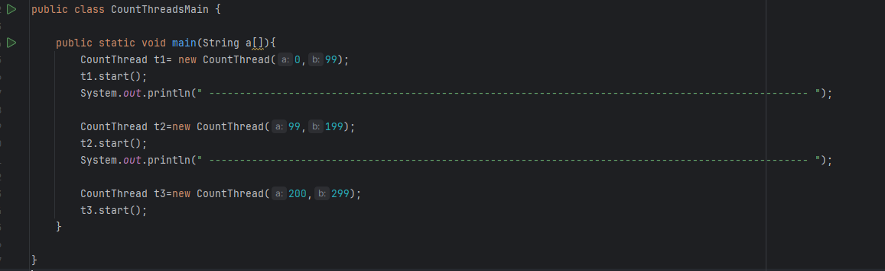

# Lab01ARSW

### Escuela Colombiana de Ingeniería
### Arquitecturas de Software - ARSW
## Ejercicio Introducción al paralelismo - Hilos - Caso BlackListSearch


**Parte I - Introducción a Hilos en Java**

1. De acuerdo con lo revisado en las lecturas, complete las clases CountThread, para que las mismas definan el ciclo de vida de un hilo que imprima por pantalla los números entre A y B.


2. Complete el método __main__ de la clase CountMainThreads para que:
    1. Cree 3 hilos de tipo CountThread, asignándole al primero el intervalo [0..99], al segundo [99..199], y al tercero [200..299].
    2. Inicie los tres hilos con 'start()'.
    3. Ejecute y revise la salida por pantalla.
    4. Cambie el incio con 'start()' por 'run()'. Cómo cambia la salida?, por qué?.

### Con Start


### Ejecucion


* Como se puede evidenciar , Iniciando los hilos con 'start()', se ejecutan aleatoriamente mezclando los intervalos.


### Con Run


### Ejecucion


* Como se puede evidenciar , Iniciando los hilos con 'run()', se ejecutan en orden y por lo tanto no  mezclan los intervalos.


### run() vs start() 

Cuando se usa  el método  start()  en Java para iniciar varios hilos, cada uno se ejecuta de forma independiente y al mismo tiempo, lo que significa que el sistema operativo decide cuándo y cómo se ejecuta cada hilo. Esto provoca que los resultados se mezclen y no sigan un orden fijo. En cambio, si se usa  el método  run()  directamente, no se crean hilos nuevos, sino que las funciones se ejecutan una tras otra dentro del mismo hilo principal, como cualquier otra función normal. Por eso, los resultados aparecen en orden, pero no se  aprovecha la verdadera concurrencia que ofrecen los hilos.


**Parte II - Ejercicio Black List Search**


Para un software de vigilancia automática de seguridad informática se está desarrollando un componente encargado de validar las direcciones IP en varios miles de listas negras (de host maliciosos) conocidas, y reportar aquellas que existan en al menos cinco de dichas listas.

Dicho componente está diseñado de acuerdo con el siguiente diagrama, donde:

- HostBlackListsDataSourceFacade es una clase que ofrece una 'fachada' para realizar consultas en cualquiera de las N listas negras registradas (método 'isInBlacklistServer'), y que permite también hacer un reporte a una base de datos local de cuando una dirección IP se considera peligrosa. Esta clase NO ES MODIFICABLE, pero se sabe que es 'Thread-Safe'.

- HostBlackListsValidator es una clase que ofrece el método 'checkHost', el cual, a través de la clase 'HostBlackListDataSourceFacade', valida en cada una de las listas negras un host determinado. En dicho método está considerada la política de que al encontrarse un HOST en al menos cinco listas negras, el mismo será registrado como 'no confiable', o como 'confiable' en caso contrario. Adicionalmente, retornará la lista de los números de las 'listas negras' en donde se encontró registrado el HOST.


Al usarse el módulo, la evidencia de que se hizo el registro como 'confiable' o 'no confiable' se dá por lo mensajes de LOGs:

INFO: HOST 205.24.34.55 Reported as trustworthy

INFO: HOST 205.24.34.55 Reported as NOT trustworthy


Al programa de prueba provisto (Main), le toma sólo algunos segundos análizar y reportar la dirección provista (200.24.34.55), ya que la misma está registrada más de cinco veces en los primeros servidores, por lo que no requiere recorrerlos todos. Sin embargo, hacer la búsqueda en casos donde NO hay reportes, o donde los mismos están dispersos en las miles de listas negras, toma bastante tiempo.

Éste, como cualquier método de búsqueda, puede verse como un problema [vergonzosamente paralelo](https://en.wikipedia.org/wiki/Embarrassingly_parallel), ya que no existen dependencias entre una partición del problema y otra.

Para 'refactorizar' este código, y hacer que explote la capacidad multi-núcleo de la CPU del equipo, realice lo siguiente:

1. Cree una clase de tipo Thread que represente el ciclo de vida de un hilo que haga la búsqueda de un segmento del conjunto de servidores disponibles. Agregue a dicha clase un método que permita 'preguntarle' a las instancias del mismo (los hilos) cuantas ocurrencias de servidores maliciosos ha encontrado o encontró.
    

   
   

   

   

2. Agregue al método 'checkHost' un parámetro entero N, correspondiente al número de hilos entre los que se va a realizar la búsqueda (recuerde tener en cuenta si N es par o impar!). Modifique el código de este método para que divida el espacio de búsqueda entre las N partes indicadas, y paralelice la búsqueda a través de N hilos. Haga que dicha función espere hasta que los N hilos terminen de resolver su respectivo sub-problema, agregue las ocurrencias encontradas por cada hilo a la lista que retorna el método, y entonces calcule (sumando el total de ocurrencuas encontradas por cada hilo) si el número de ocurrencias es mayor o igual a _BLACK_LIST_ALARM_COUNT_. Si se da este caso, al final se DEBE reportar el host como confiable o no confiable, y mostrar el listado con los números de las listas negras respectivas. Para lograr este comportamiento de 'espera' revise el método [join](https://docs.oracle.com/javase/tutorial/essential/concurrency/join.html) del API de concurrencia de Java. Tenga también en cuenta:


    * Dentro del método checkHost Se debe mantener el LOG que informa, antes de retornar el resultado, el número de listas negras revisadas VS. el número de listas negras total (línea 60). Se debe garantizar que dicha información sea verídica bajo el nuevo esquema de procesamiento en paralelo planteado.

    * Se sabe que el HOST 202.24.34.55 está reportado en listas negras de una forma más dispersa, y que el host 212.24.24.55 NO está en ninguna lista negra.
   ```
   public CheckResult checkHost(String ipAddress, int numThreads) {
        List<Integer> blackListOccurrences = new LinkedList<>();
        int occurrencesCount = 0;

        HostBlacklistsDataSourceFacade skds = HostBlacklistsDataSourceFacade.getInstance();
        int totalServers = skds.getRegisteredServersCount();

        if (numThreads <= 0) numThreads = 1;
        if (numThreads > totalServers) numThreads = totalServers;

        int segmentSize = totalServers / numThreads;
        int remainder = totalServers % numThreads;

        List<BlacklistSearchThread> threads = new ArrayList<>();
        int start = 0;
        for (int i = 0; i < numThreads; i++) {
            int end = start + segmentSize + (i < remainder ? 1 : 0);
            threads.add(new BlacklistSearchThread(ipAddress, start, end, skds));
            start = end;
        }

        LOG.log(Level.INFO, "Starting parallel check for IP: {0} with {1} threads",
                new Object[]{ipAddress, numThreads});

        threads.forEach(Thread::start);
        threads.forEach(t -> {
            try {
                t.join();
            } catch (InterruptedException e) {
                LOG.log(Level.SEVERE, "Thread interrupted", e);
                Thread.currentThread().interrupt();
            }
        });

        int reviewedServers = 0;
        for (BlacklistSearchThread t : threads) {
            blackListOccurrences.addAll(t.getBlackListOccurrences());
            occurrencesCount += t.getOccurrencesCount();
            reviewedServers += (t.getEndIndex() - t.getStartIndex());
        }

        if (occurrencesCount >= BLACK_LIST_ALARM_COUNT) {
            skds.reportAsNotTrustworthy(ipAddress);
            LOG.log(Level.SEVERE, "IP {0} is NOT trustworthy. Found in {1} blacklists.",
                    new Object[]{ipAddress, occurrencesCount});
        } else {
            skds.reportAsTrustworthy(ipAddress);
            LOG.log(Level.INFO, "IP {0} is trustworthy. Found in {1} blacklists.",
                    new Object[]{ipAddress, occurrencesCount});
        }

        LOG.log(Level.INFO, "Blacklist check completed. Reviewed: {0}/{1} servers.",
                new Object[]{reviewedServers, totalServers});

        return new CheckResult(blackListOccurrences, reviewedServers);
    }
   ```

**Parte II.I Para discutir la próxima clase (NO para implementar aún)**

La estrategia de paralelismo antes implementada es ineficiente en ciertos casos, pues la búsqueda se sigue realizando aún cuando los N hilos (en su conjunto) ya hayan encontrado el número mínimo de ocurrencias requeridas para reportar al servidor como malicioso. Cómo se podría modificar la implementación para minimizar el número de consultas en estos casos?, qué elemento nuevo traería esto al problema?

**Parte III - Evaluación de Desempeño**

A partir de lo anterior, implemente la siguiente secuencia de experimentos para realizar las validación de direcciones IP dispersas (por ejemplo 202.24.34.55), tomando los tiempos de ejecución de los mismos (asegúrese de hacerlos en la misma máquina):

1. Un solo hilo.


2. Tantos hilos como núcleos de procesamiento (haga que el programa determine esto haciendo uso del [API Runtime](https://docs.oracle.com/javase/7/docs/api/java/lang/Runtime.html)).
   

3. Tantos hilos como el doble de núcleos de procesamiento.
   

4. 50 hilos.
   

5. 100 hilos.


Al iniciar el programa ejecute el monitor jVisualVM, y a medida que corran las pruebas, revise y anote el consumo de CPU y de memoria en cada caso. 

Con lo anterior, y con los tiempos de ejecución dados, haga una gráfica de tiempo de solución vs. número de hilos. Analice y plantee hipótesis con su compañero para las siguientes preguntas (puede tener en cuenta lo reportado por jVisualVM):

**Parte IV - Ejercicio Black List Search**

1. Según la [ley de Amdahls](https://www.pugetsystems.com/labs/articles/Estimating-CPU-Performance-using-Amdahls-Law-619/#WhatisAmdahlsLaw?):

   , donde _S(n)_ es el mejoramiento teórico del desempeño, _P_ la fracción paralelizable del algoritmo, y _n_ el número de hilos, a mayor _n_, mayor debería ser dicha mejora. Por qué el mejor desempeño no se logra con los 500 hilos?, cómo se compara este desempeño cuando se usan 200?.

2. Cómo se comporta la solución usando tantos hilos de procesamiento como núcleos comparado con el resultado de usar el doble de éste?.

3. De acuerdo con lo anterior, si para este problema en lugar de 100 hilos en una sola CPU se pudiera usar 1 hilo en cada una de 100 máquinas hipotéticas, la ley de Amdahls se aplicaría mejor?. Si en lugar de esto se usaran c hilos en 100/c máquinas distribuidas (siendo c es el número de núcleos de dichas máquinas), se mejoraría?. Explique su respuesta.


## ¿Por qué el mejor desempeño no se logra con 500 hilos?

Según la Ley de Amdahl, teóricamente el desempeño debería mejorar con más hilos. Sin embargo, en la práctica esto no ocurre por varias razones:

1. **Sobrecarga de gestión de hilos**: Crear, programar y realizar cambios de contexto entre tantos hilos genera un costo computacional significativo.

2. **Recursos limitados**: Si un sistema tiene, por ejemplo, 8 núcleos, tener 500 hilos significa que la mayoría estarán en espera, causando:
   - Contención por recursos compartidos
   - Mayor tiempo en cambios de contexto
   - Saturación de la memoria caché

3. **Fracción no paralelizable**: La Ley de Amdahl establece que el speedup está limitado por la parte secuencial del programa, siguiendo la fórmula:
   ```
   S(n) = 1 / ((1-P) + P/n)
   ```
   Cuando n (número de hilos) se vuelve muy grande, el límite del speedup es 1/(1-P).

## Comparación con 200 hilos

Con 200 hilos comparado con 500, probablemente haya menos sobrecarga, pero sigue siendo excesivo para la mayoría de sistemas. El rendimiento suele seguir una curva donde:
- Primero aumenta al añadir hilos
- Alcanza un punto óptimo (generalmente cercano al número de núcleos o un pequeño múltiplo)
- Luego decrece debido a la sobrecarga

## Hilos por núcleo vs. doble de hilos

Usar tantos hilos como núcleos disponibles suele ser una buena estrategia inicial, ya que:
- Cada hilo puede ejecutarse en su propio núcleo sin interrupciones
- Se minimiza la sobrecarga por cambios de contexto

Usar el doble de hilos que núcleos puede mejorar el rendimiento en casos donde:
- Los hilos ocasionalmente esperan por operaciones de E/S
- Hay períodos de inactividad que pueden aprovecharse

Sin embargo, para tareas intensivas en CPU, duplicar el número de hilos generalmente no ofrece beneficios significativos y puede reducir el rendimiento.

## Distribución en múltiples máquinas

### 100 hilos en una CPU vs. 1 hilo en 100 máquinas

La Ley de Amdahl sigue aplicándose en computación distribuida, pero con consideraciones adicionales:

- **Ventajas**:
  - Cada máquina tiene recursos dedicados (CPU, memoria, caché)
  - Se evita la contención local por recursos

- **Desventajas**:
  - Se introduce latencia de red
  - Hay sobrecarga por comunicación entre máquinas
  - La parte no paralelizable puede volverse un cuello de botella aún mayor

Si el problema requiere poca comunicación entre hilos, la distribución en 100 máquinas podría ser más eficiente. Sin embargo, para tareas que requieren comunicación frecuente, la sobrecarga de red podría anular las ventajas.

### c hilos en 100/c máquinas distribuidas

Este enfoque híbrido suele ser el más eficiente porque:

1. **Optimiza el paralelismo local**: Aprovecha los núcleos disponibles en cada máquina
2. **Reduce la sobrecarga de comunicación**: Menos máquinas significa menos comunicación por red
3. **Equilibra recursos**: Aprovecha tanto el paralelismo dentro de cada nodo como entre nodos

La configuración óptima dependerá de:
- Las características específicas del problema
- El patrón de comunicación entre hilos
- La relación entre la parte paralelizable y secuencial del algoritmo
- La arquitectura de hardware disponible


